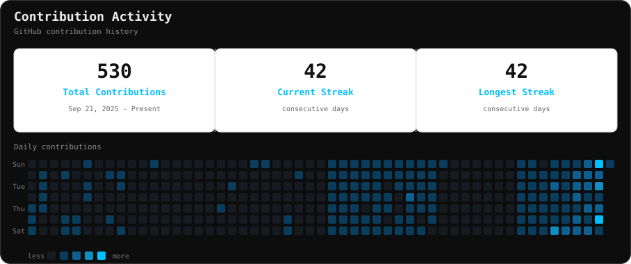

<h3><code>KAWSAR AHMED RAHIM</code></h3>
<table><tr>
<td valign="top"></td>
<td valign="top"></td>
</tr></table>

---

## <code>About Me</code>

👨‍💻 **Full-Stack Developer & Competitive Programmer**

I am a Full-Stack Developer and Competitive Programmer dedicated to building scalable, performant web applications while sharpening my problem-solving skills through Data Structures & Algorithms. Passionate about clean system design, efficient code, and turning ideas into real, working products.

---

## <code>Top Languages by Codebase</code>

## <code>Top Languages by Codebase</code>

---

## **<code>Contribution Activity</code>**

---

## <code>Achievements</code>

GitHub achievement icons are account-specific. View the achievements currently awarded to this account:

---

## <code>Featured Gallery</code>

<table><tr>
<td width="50%" valign="top">
<h3>🍽️ Restaurant App</h3>

Full-stack restaurant experience with React and a Node/Express backend.
 <b>Stack:</b> React · Node.js · Express · MongoDB
</td>
<td width="50%" valign="top">
<h3>🧑‍💻 Portfolio</h3>

Personal developer portfolio presenting skills, projects and contact information.
 <b>Stack:</b> React · Vite · Framer Motion
</td>
</tr></table>

---

## <code>Tech Arsenal</code>

### Frontend / UI

### Backend / Database

### Tools / DevOps

### Deploy

### Languages

---

## <code>What I'm Up To</code>

| Focus                 | Current state                                                          |
| --------------------- | ---------------------------------------------------------------------- |
| 🚧 Currently Building | Full-stack web applications with React, Node.js and Python/Django      |
| 📚 Learning           | Better architecture, APIs, deployment and production engineering       |
| ⚡ Fun Fact           | I enjoy turning programming logic into interactive browser experiences |

---

## <code>Socials</code>

  

---

Built with ◈ passion for cinematic developer identity. 
© The Cipher Stack — All rights reserved.

